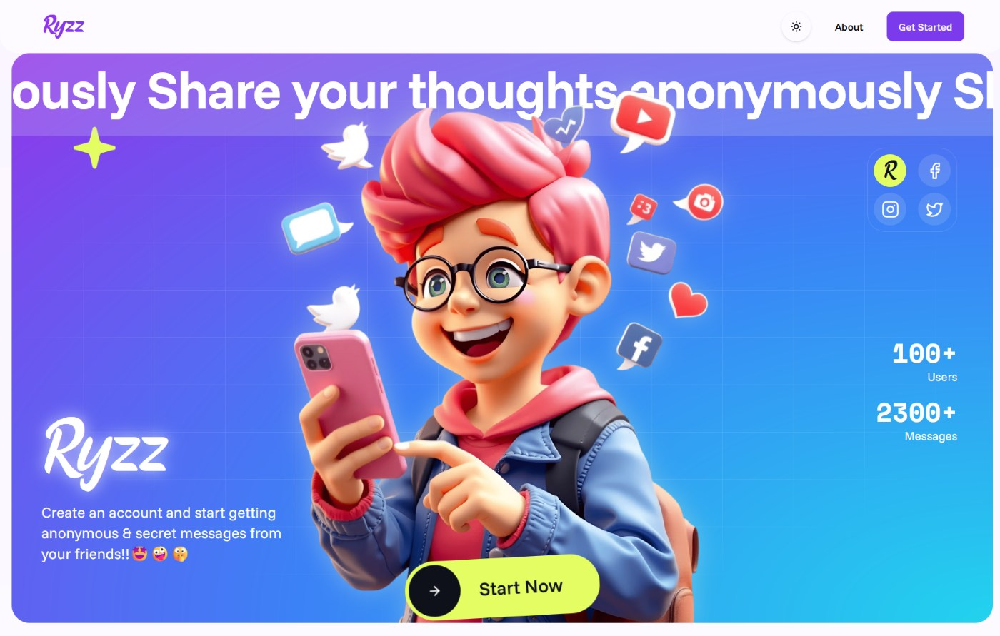

# Ryzz - Get Anonymous Messages From Your Friends! 🤩

Ryzz is a web application that lets you receive anonymous messages from friends and family in a fun and secure way.

## Features ✨

- Complete anonymity - no IP tracking or user identification
- Share messages on social media platforms
- Customizable message cards with gradients
- Instagram and Snapchat story templates
- Modern, responsive UI
- Secure authentication with Clerk
- PWA support

## Tech Stack 🛠️

- [Next.js 14](https://nextjs.org/) - React framework
- [TailwindCSS](https://tailwindcss.com/) - Styling
- [Prisma](https://www.prisma.io/) - ORM
- [MongoDB](https://www.mongodb.com/) - Database
- [Clerk](https://clerk.com/) - Authentication
- [shadcn/ui](https://ui.shadcn.com/) - UI Components
